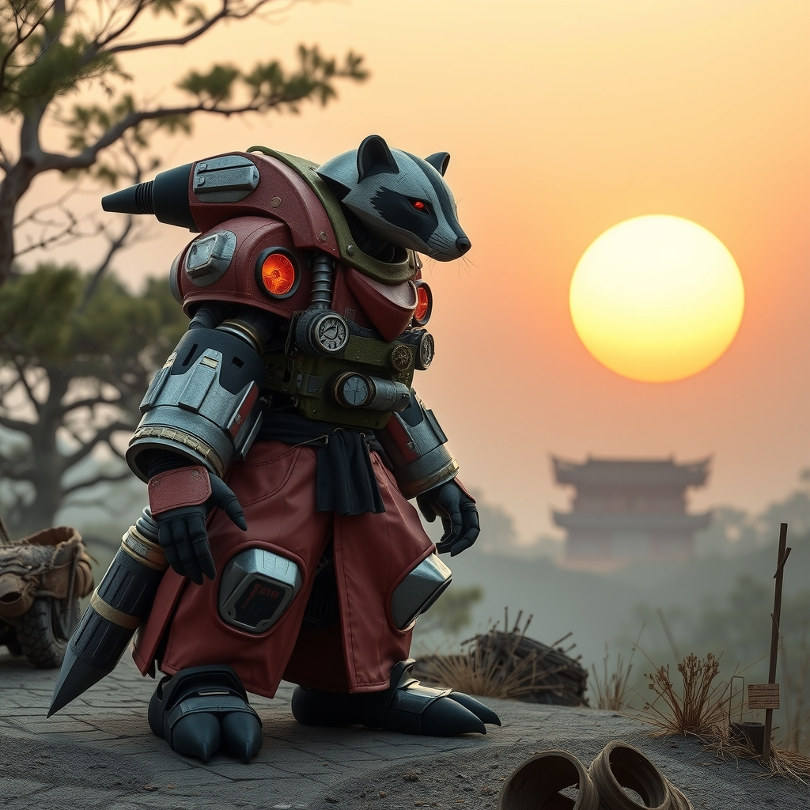

## Motivation:
There are currently no open-source Bitcoin mining firmware options and we're going to change that with this project. Unless you are running your miner in the exact conditions it was engineered for then you have probably experienced the headache of dealing with closed parameters in the firmware that you can't change. There are several aftermarket firmware options available that provide additional flexibility beyond the manufacturers firmware but they are all closed source and still they leave something to be desired when it comes to customizations. Beyond being open-source, the main highlights of the Mujina Mining Firmware are: Linux based, multi driver compatible, and Stratum v2 client support. This will unlock hacks like changing the main supply voltage, swapping out or removing the fans, changing ASIC voltage & frequency, and anything else the end user wants to change.   

## Scope:
One Project Manager position and one or two engineer positions to fulfill the mission of The 256 Foundation, “Dismantle the proprietary mining empire to make Bitcoin and freedom tech accessible to anyone”. This grant proposal aims to secure funding for:

* One project manager to oversee and ensure mission adherence, timeliness, and execution. 
* One or two engineers to develop the Mujina Firmware.
* Mujina specifics: Fully open-source Linux-based mining firmware which is compatible with a range of Bitcoin mining hardware drivers like Antminer, Whatsminer, Avalon, and the list can be extended.
* A built-in StratumV2 client.
* User-friendly dashboard.
* Complete client architecture. 
* Supporting documentation and specifications. 
* This project is fully open-source GPL licensed.
* Excluded from this proposal are sales, distribution, marketing, and customer technical support.

In summary, the Mujina Firmware delivers an open-source, multi driver compatible, Linux-based Bitcoin mining firmware. The open-source nature makes integrating it in a variety of ways possible; giving end-users complete control over all variables of their mining environments. The open and modular platform provides the essential tools for broad open development and a solid foundation for anyone to incorporate drivers for any hardware they want, akin to the shape-shifting Japanese badger, the Mujina, that can take on endless forms. Not only does Mujina equip users with a powerful tool for adapting Bitcoin miners to a variety of business models and use cases but it also takes direct aim at altering the centralized and closed-source trajectory that the Bitcoin mining ecosystem has taken.

## Deliverables:
The deliverables from this grant are a modular style firmware with multiple drivers that can be slotted in for a range of available hardware platforms, including but not limited to: Antminer, Whatsminer, and Avalon. The deliverables will be produced within the allotted timeline and for the available budget, resulting in an open-source project that aligns with The 256 Foundation mission and benefits the public at large. 

## Timeline:
The timeline for this grant proposal is twelve months with the opportunity to extend the grant at the conclusion of each twelve month period, pending negotiations.

## Materials:
Materials for this project’s initial release are included in the budget. Potential materials for the project may include but are not limited to compute modules, various I/O boards, various common mining rigs like Antminer or Whatsminer, and various other tools or software.

## Team Members:
This proposal is for one project manager and one or two engineers. 

## Budget:
For security reasons, exact dollar amounts are kept confidential. This project budget covers fair-market compensation for one project manager as well as the materials, travel expenses, and living expenses for one or two engineers for twelve months. Funds are disbursed monthly in equal amounts. Within 30-days prior to the expiration of this grant, a renewal opportunity will open and be subject to review and negotiation.  
